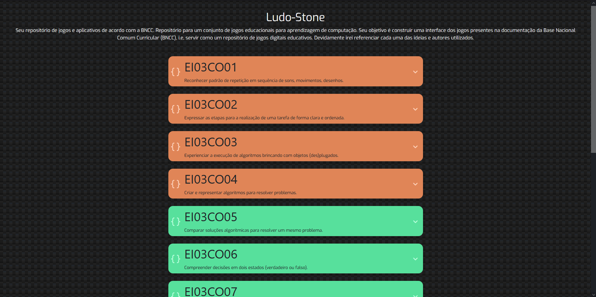
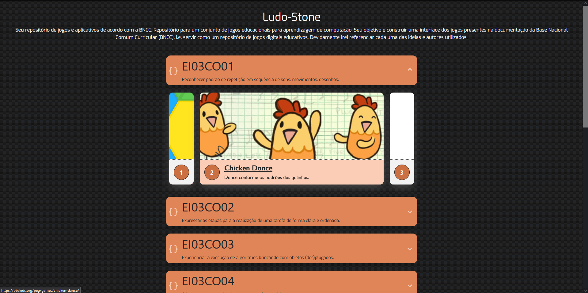
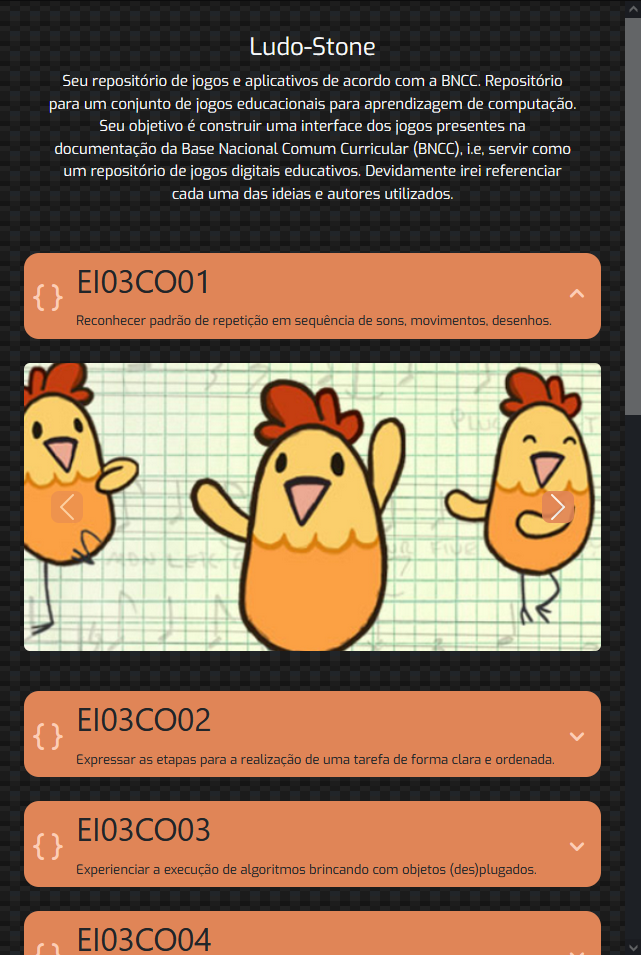
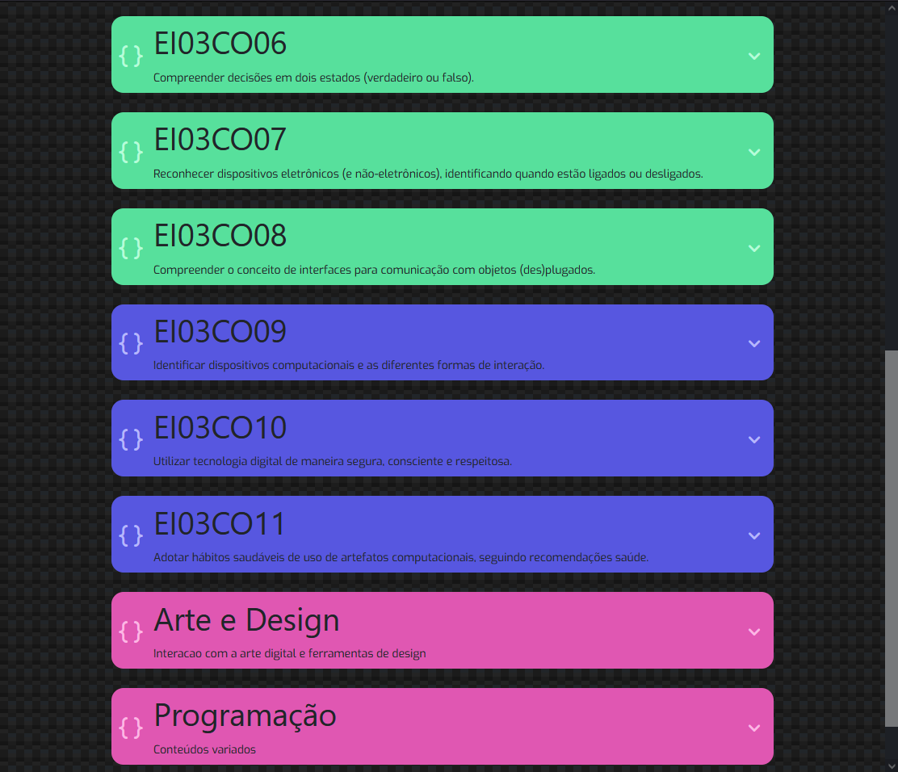

# Responsive Ludostone

Repositório para um conjunto de jogos educacionais para aprendizagem de computação. Seu objetivo é construir uma interface dos jogos presentes na documentação da Base Nacional Comum Curricular (BNCC), i.e, servir como um repositório de jogos digitais educativos. Devidamente irei referenciar cada uma das ideias e autores utilizados.

# Desenvolvimento contínuo:

Alguns ajustes podem vir, especialmente na parte de componentização. Uma vez que seria melhor desenvolver esse projeto em React Js.

### Screenshot

# Recursos úteis:

- [Stunning Card Animation](https://www.youtube.com/watch?v=45mnmy2JUl0)
- [CSS - Bacground](https://codepen.io/manifestinteractive/pen/DmBJXy)
- [ChatGPT](https://chat.openai.com/)

# Autor

- Github - [@fty57](https://github.com/fty57)

# Adições

Nesse projeto, foi adicionado sites e plataformas, além dos previstos pela documentação da BNCC, uma vez que podem contribuir para novos caminhos de estudos tanto pelo professor quanto aluno.
